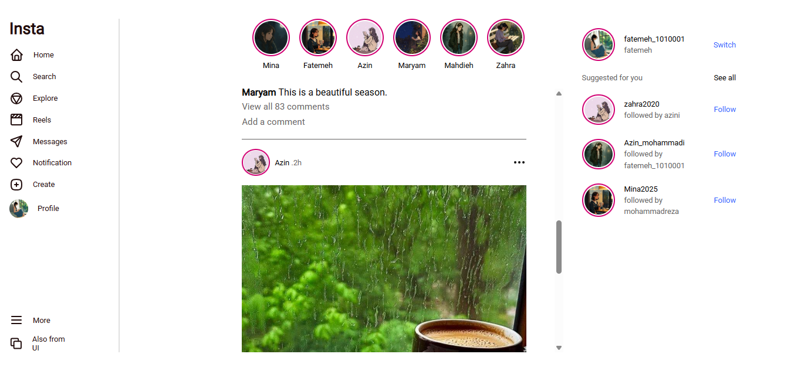
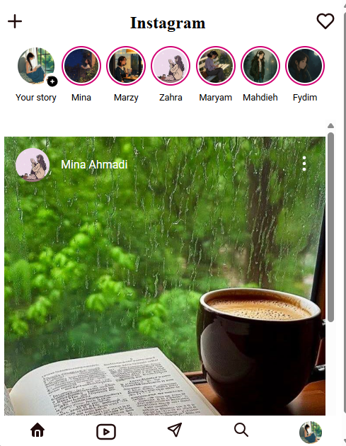
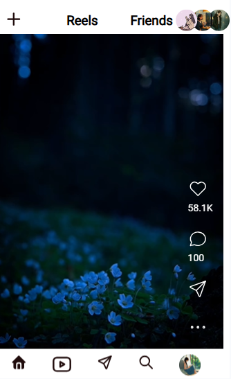
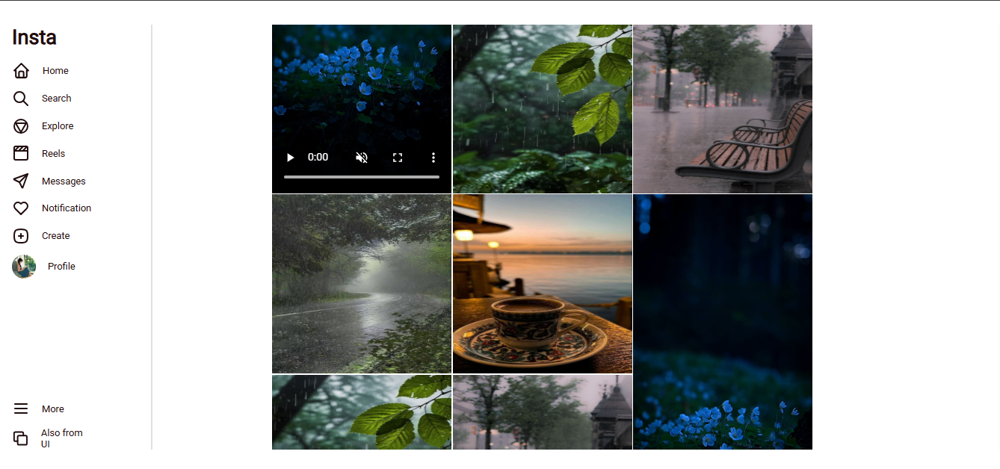

# 📱 Frontend UI Sample – Instagram Inspired

## 🎯 Project Goal
This project is an **educational frontend practice** that recreates a **social media style interface inspired by popular platforms**.  
⚠️ Disclaimer: This project has **no affiliation with any Company**. All icons, logos, and graphical assets have been **replaced or modified**, and the code is intended solely for **learning purposes**.

---

## ✨ Features
- **Responsive design** — adapts smoothly across desktops, tablets, and mobile screens
- **Multi-page layout** with dedicated sections:
  - 🏠 **Home** – story bar, main feed with posts & comments, and suggestion sidebar
  - 🔍 **Explore** – grid-based media gallery for discovering content
  - 🎥 **Reels** – video-style feed with scrollable, full-bleed layout
  - 💬 **Messages** – basic inbox structure (static UI placeholder)
  - 🔐 **Login / Sign up forms** (located in `frms_templates/`)
- **Pure HTML5 & CSS3** – no frameworks, no JavaScript
- **Clean, beginner-friendly code structure** – separated concerns with clear folder layout
- **Tagged version history**:
  - `v1.0` – initial stable release (Oct 2025) with the original full layout
  - `v2.0` (current `main`) – redesigned responsive version; currently `Home`, `Explore` and `Reels` are functional
---

## 🛠️ Tech Stack
- **HTML5**  
- **CSS3 (Flexbox, Grid)**  

---

## 🚀 Live Demo
👉 [Click here to see the Live Demo](https://fatemeh-ch.github.io/Insta-UI-sample/)

---

## 📸 Screenshots

### 🕰️ Old Version (v1.0)
<table>
  <tr>
    <td align="center"></td>
    <td align="center"></td>
    <td align="center"></td>
  </tr>
</table>

### ✨ New Version (v2.0)
<table style="border-collapse: separate; border-spacing: 0 8px;">
  <tr>
    <td colspan="2"></td>
  </tr>
  <tr><td colspan="2" style="height: 8px;"></td></tr>
  <tr>
    <td></td>
    <td></td>
  </tr>
  <tr><td colspan="2" style="height: 8px;"></td></tr>
  <tr>
    <td colspan="2"></td>
  </tr>
</table>

---

## 🚀 Installation

1. Clone this repository:

   ```bash
   git clone https://github.com/fatemeh-ch/Insta-UI-sample.git


2.Open the index.html file in your web browser.


## 📂 Project Structure
```
Insta-UI-sample/
├── index.html
├── explore.html
├── reels.html
├── assets/
│   ├── images/
│   ├── fonts/
│   ├── styles/
│   └── videos/
└── Version 1/           # Tagged stable version (v1.0)
    └── assets/
```

## 📘 What I Learned
- Structuring a frontend project with clean, separated concerns
- Building responsive layouts using CSS Flexbox & Grid
- Maintaining consistent spacing and typography across components
- Writing readable, educational code others can learn from
- Using Git tags to mark stable versions (`v1.0`, `v2.0`)
